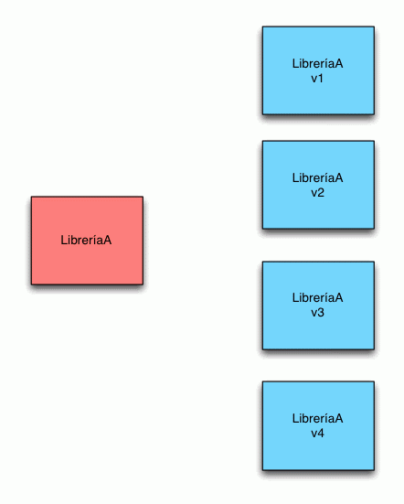
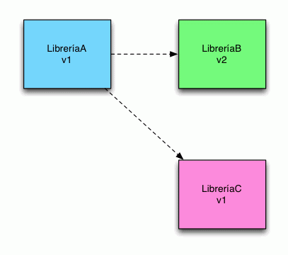
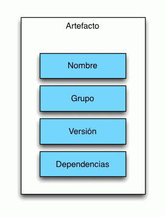

## Maven.


Normalmente cuando nosotros trabajamos con Java/JavaEE el uso de librerías es algo común como en cualquier otro lenguaje de programación.


## Librerías y limitaciones
El concepto de librería es un concepto que a veces es limitado. Por ejemplo nosotros podemos querer utilizar la librería A en nuestro proyecto. Sin embargo no nos valdrá con simplemente querer utilizar la librería sino que ademas necesitaremos saber que versión exacta de ella necesitamos.



*¿Es esto suficiente?.* Lamentablemente no lo es, una librería puede depender de otras librerías para funcionar de forma correcta. Así pues necesitamos más información para gestionarlo todo de forma correcta.


 
## Maven y Artefactos
Maven solventa esta problema a traves del concepto de *Artefacto.* Un Artefacto puede verse como una *librería con esteroides* (aunque agrupa mas conceptos). Contiene las clases propias de la librería pero ademas incluye toda la información necesaria para su correcta gestión (grupo, versión, dependencias etc).



## Artefactos y POM
Para definir un Artefacto necesitamos crear un fichero POM.xml (Proyect Object Model) que es el encargado de almacenar toda la información que hemos comentado anteriormente:

```
<project xmlns="http://maven.apache.org/POM/4.0.0" xmlns:xsi="http://www.w3.org/2001/XMLSchema-instance"
 xsi:schemaLocation="http://maven.apache.org/POM/4.0.0 http://maven.apache.org/xsd/maven-4.0.0.xsd">

 <modelVersion>4.0.0</modelVersion>
 <groupId>com.genbetadev.proyecto1</groupId>
 <artifactId>proyecto1</artifactId>
 <version>0.0.1-SNAPSHOT</version>
 <packaging>jar</packaging>
 <dependencies>

 <dependency>
 <groupId>log4j</groupId>
 <artifactId>log4j</artifactId>
 <version>1.2.17</version>
 </dependency>

</dependencies>
</project>

```

La estructura del fichero puede llegar a ser muy compleja y puede llegar a depender de otros POM. En este ejemplo estamos viendo el fichero más sencillo posible. En el se define el nombre del Artefacto (artifactID) el tipo de empaquetado (jar) y también las dependencias que tiene (log4j). De esta manera nuestra librería queda definida de una forma mucho más clara.

## Maven Repositorio y Artefactos
Una vez definidos correctamente todos los Artefactos que necesitamos, Maven nos provee de un Repositorio donde alojar, mantener y distribuir estos. Permitiéndonos una gestión correcta de nuestra librerías, proyectos y dependencias.

[](rep.gif)

El uso de Maven es a día de hoy una necesitad en cualquier proyecto Java/Java EE de cierta entidad.

